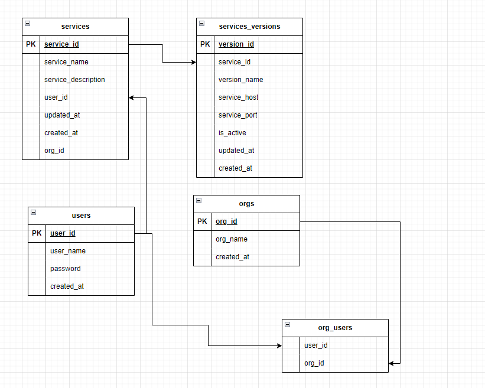

# services-sample

## Functionality.
- mysql has been choosen to for persistence.
- User able to login using email and password
- User can list the orgs to which he has access.
- User can list services of the org.
- User can see the specific service details.
- is_active in versions depict the active version of that service.
- reqRes.md contains the smaple request and response that would be recived from api calls.
- services_sample.sql contains mysql structure as well as sample data.

## DB structure draw.io
